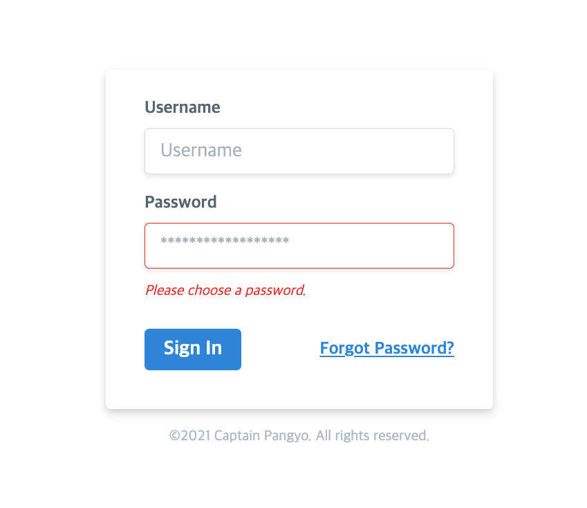

## 실습 과제 안내

jQuery로 작성되어 있는 회원가입 폼을 Vue.js 코드로 변환해보는 실습입니다.

## 실습 목표

- [ ] Vue CLI로 프로젝트를 생성할 수 있다.
- [ ] 화면 UI 요소 단위의 컴포넌트 설계 및 구현이 가능하다.
- [ ] Vue.js 문법으로 데이터 바인딩 및 이벤트 처리가 가능하다.
- [ ] HTTP 라이브러리를 이용해 서버에 데이터를 보낼 수 있다.
- [ ] 최신 자바스크립트 문법(ES6+)을 이용해 코드를 작성할 수 있다.
- [ ] 외부 CSS, JS 라이브러리를 사용하여 Vue.js 개발을 할 수 있다.

## 실습 환경

- Node.js LTS 설치
- 최신 Vue CLI 설치
- 선호하는 웹 개발 툴

## 실습 대상 UI



## 실습 절차

1. 현재 깃헙 리포지토리를 포크(fork)합니다.
2. 포크된 리포지토리를 클론한뒤 homework 폴더에서 아래 명령어로 뷰 프로젝트를 생성합니다.

```bash
# 명령어 예시
vue create "본인 이름"
# 실제 예시
vue create jangkeehyo
```

3. `homework/index.html` 파일의 내용을 Vue.js 문법으로 변환합니다. 이 때 위에 안내된 실습 목표를 모두 달성할 수 있도록 최대한 많은 Vue.js 개념을 활용하여 구현합니다.
4. Vue.js로 변환한 내용을 커밋(commit)한 뒤 `https://github.com/joshua1988/vue-advanced-lgcns` 리포지토리를 대상으로 풀 리퀘스트(Pull Request)를 생성합니다.


